# ADR 0002 — DDD Layered Architecture

**Status:** Accepted
**Date:** 2026-02-17
**ISO 27001 Controls:** A.14 (System acquisition, development, and maintenance)

---

## Context

ISO 27001 A.14 requires that security considerations are designed into systems from the start,
not bolted on afterwards. A clear architectural boundary prevents infrastructure concerns
(database, HTTP, AWS SDK) from leaking into business logic, which would make security auditing
harder and increase the attack surface.

We needed an architecture that:
1. Keeps domain logic pure and testable without I/O.
2. Makes the dependency direction auditable by automated tooling.
3. Is consistent and recognizable across seven different technology stacks.

---

## Decision

We adopt a **four-layer DDD architecture** with a strict top-down dependency rule:

```mermaid
flowchart TD
  api["🌐 api\ncontrollers · routes\nHTTP boundary"]
  core["⚙️ core\nuse-cases · middleware · guards\nOrchestration"]
  domain["🏛️ domain\nentities · events · value objects\nPure business logic"]
  infra["🔌 infrastructure\nDB · Redis · AWS SDK\nI/O adapters"]

  api --> core
  core --> domain
  core --> infra
  infra --> domain

  style api    fill:#c0392b,color:#ffffff,stroke:#922b21
  style core   fill:#2471a3,color:#ffffff,stroke:#1a5276
  style domain fill:#1e8449,color:#ffffff,stroke:#196f3d
  style infra  fill:#b7950b,color:#ffffff,stroke:#9a7d0a
```

Allowed import directions:

```mermaid
flowchart TD
  api["🌐 api"]
  core["⚙️ core"]
  domain["🏛️ domain"]
  infra["🔌 infrastructure"]

  api -->|"✅ may import"| core
  api -->|"✅ may import"| domain
  core -->|"✅ may import"| domain
  core -->|"✅ may import"| infra
  infra -->|"✅ may import"| domain

  api -. "❌ forbidden" .-> infra
  infra -. "❌ forbidden" .-> api
  infra -. "❌ forbidden" .-> core
  domain -. "❌ forbidden" .-> api
  domain -. "❌ forbidden" .-> core
  domain -. "❌ forbidden" .-> infra

  style api    fill:#c0392b,color:#ffffff,stroke:#922b21
  style core   fill:#2471a3,color:#ffffff,stroke:#1a5276
  style domain fill:#1e8449,color:#ffffff,stroke:#196f3d
  style infra  fill:#b7950b,color:#ffffff,stroke:#9a7d0a
```

**Dependency rules (enforced by automated tools):**

| Layer | May import | May NOT import |
|---|---|---|
| `domain` | Nothing outside itself | `api`, `core`, `infrastructure` |
| `infrastructure` | `domain` | `api` |
| `core` | `domain`, `infrastructure` | `api` |
| `api` | `core`, `domain` | — |

**Enforcement per stack:**

| Stack | Tool | Config |
|---|---|---|
| Symfony | deptrac | `iso27001-symfony/deptrac.yaml` |
| Laravel | deptrac | `iso27001-laravel/deptrac.yaml` |
| FastAPI | import-linter | `iso27001-fastapi/.importlinter` |
| NestJS | custom TS script | `iso27001-nestjs/check-layers.ts` |
| Spring Boot | ArchUnit | `LayerArchitectureTest.java` (5 rules) |
| Go/Gin | compiler | `go build ./...` — package import graph enforced at compile time |
| Elixir/Phoenix | compiler | `mix compile` — OTP application boundary enforced at compile time |

All seven enforcement tools run in CI (see `.github/workflows/ci.yml`) and as pre-commit hooks.

---

## Alternatives Considered

| Option | Reason rejected |
|---|---|
| Hexagonal architecture (ports & adapters) | More complex to explain; same outcome achievable with simpler layer model |
| No enforced boundaries | Fails A.14 — no way to audit that security-sensitive infrastructure code hasn't leaked into domain |
| MVC only | Controller → Model shortcuts bypass domain logic, making security controls easy to miss |
| Clean Architecture (full Uncle Bob) | Excessive ceremony for a REST API blueprint; the four-layer model captures the essential invariants |

---

## Consequences

- New developers must understand the layer model before adding code; the automated check
  provides immediate feedback when boundaries are violated.
- Domain entities and events are fully unit-testable without standing up a database or HTTP server.
- The `infrastructure` layer is the single integration point for AWS SDK calls, making it easy
  to audit all external data flows for A.13 (information transfer) compliance.
- Go and Elixir/Phoenix enforce layer boundaries at compile time via the module system — no
  additional tooling is required, and violations are caught before tests even run.
- Violation of boundaries will fail CI, blocking merges — this is intentional.

---

← [ADR 0001 — JWT Authentication Strategy](0001-jwt-strategy.md) · [ADR index](../../README.md#architecture-decision-records) · Next: [ADR 0003 — Redis Fallback Pattern](0003-redis-fallback-pattern.md) →
